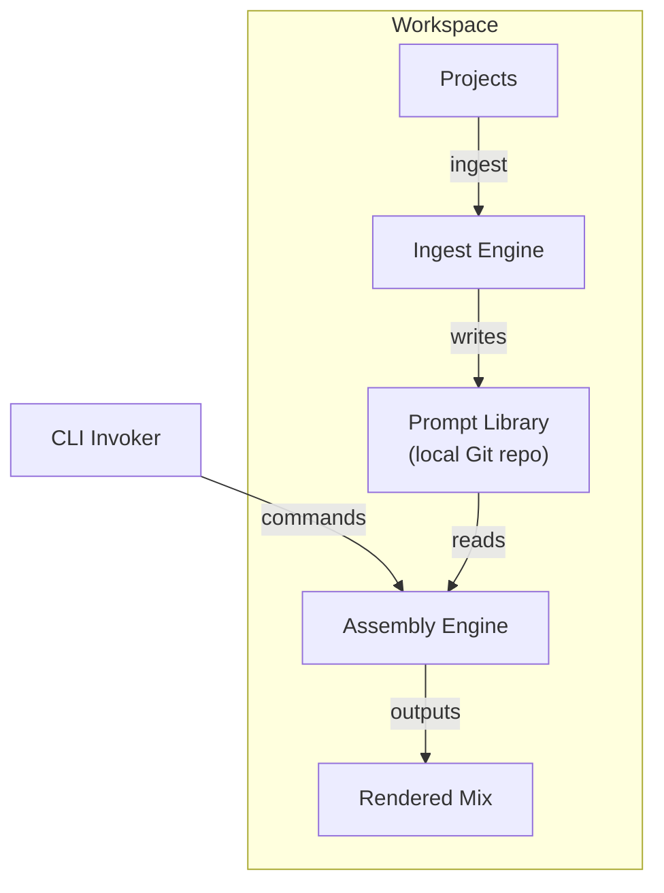

# Prompt Mixer – Product Specification (Draft v0.1)

## 1. Purpose

Provide a single **command‑line tool** (with a roadmap toward optional desktop/UIs) that helps developers *create, organise, merge* and *deploy* reusable prompt instructions across multiple GenAI coding assistants (e.g., GitHub Copilot, Cursor/Windsor, Claude, Junie).

## 2. Problem Statement

Developers accumulate ad‑hoc prompt fragments in scattered repositories. Versions diverge, domain‑specific material is duplicated, and different assistants demand different file shapes (monolithic vs. multi‑file). This causes:

* **Version confusion** – unsure which fragment is “the good one”.
* **Context bloat** – dragging enormous prompts between projects.
* **Higher friction** – manual reconciliation of fragments for each tool.

## 3. Vision & Goals

* **Mix & Slice** prompt fragments into variant‑specific bundles.
* **Ingest & Normalise** existing prompt artefacts from multiple projects.
* **Maintain a Source‑of‑Truth Library** under Git for history, collaboration, and team‑wide sharing.
* **Token Optimisation** (optional) to fit assistant limits.

## 4. Core Concepts

| Term                | Description                                                                                |
| ------------------- | ------------------------------------------------------------------------------------------ |
| **Prompt Fragment** | Small Markdown file covering a single concept (e.g., `rules-python-testing`).              |
| **Prompt Library**  | Local Git repo that stores all approved fragments (think “Obsidian vault”).                |
| **Slice**           | A filtered set of fragments (by language, layer, purpose) to assemble for a target.        |
| **Mix**             | The rendered output (single file or directory) shaped for a specific GenAI tool.           |
| **Ingest**          | Analyse existing projects, import prompt files, lint configs, style guides into fragments. |
| **Target**          | Supported assistant family (Copilot, Claude, Windsor/Cursor, Junie, etc.).                 |

## 5. Facets & Taxonomy (default)

Prompt Mixer starts with **flat‑file facets**: every fragment is a single Markdown file whose *basename* encodes its position in the logical hierarchy using **kebab‑notation** (`<facet>-<subfacet>-… .md`).  This keeps the library easy to scan in any editor or file‑listing command without digging through folders.

Example starter set:

```
purpose-overview.md                # Why the project exists
principles-engineering.md          # Four Rules of Simple Design, etc.
rules-python-project.md            # pyproject.toml conventions
rules-python-cli.md                # console-script packaging rules
rules-python-testing.md            # pytest style & structure
rules-markdown.md                  # Markdown formatting rules
processes-release.md               # Version-bump & changelog procedure
```

Key points

* **Facet = first segment** (`purpose`, `principles`, `rules`, `processes`).
* **Sub-facets** follow as additional dash segments; depth is unlimited but we encourage brevity.
* Prompt Mixer treats the dash segments purely as tags, so `rules-python` and `rules-typescript` can coexist and slice cleanly.
* Teams can rename or split files at any time; `pmx reorganise` (see 8.7) helps with batch moves/renames.

*Note: Folders are still supported for those who prefer them—Prompt Mixer simply flattens folder paths into kebab notation internally.*
Key points

* **Facet = first segment** (`purpose`, `principles`, `rules`, `processes`).
* **Sub‑facets** follow as additional dash segments; depth is unlimited but we encourage brevity.
* Prompt Mixer treats the dash segments purely as tags, so `rules-python` and `rules-typescript` can coexist and slice cleanly.
* Teams can rename or split files at any time; `pmx reorganise` (see 8.7) helps with batch moves/renames.

*Note: Folders are still supported for those who prefer them—Prompt Mixer simply flattens folder paths into kebab notation internally.*

## 6. Target Users

* Individual developers juggling multiple repos.
* Teams standardising prompts across members.
* Tool authors who bundle opinionated prompt packs.

## 7. Key Use‑Cases

1. **`pmx assemble --target copilot`** – Build a single `copilot.json` from selected fragments.
2. **`pmx slice lang:python layer:testing`** – Export only Python‑testing rules for a new repo.
3. **`pmx ingest ./my‑old‑repo`** – Import existing prompts & lint configs into the library.
4. **`pmx merge repo1 repo2 --lang python`** – Diff & amalgamate similar fragments.
5. **`pmx sync [--pull | --push]`** – Share the prompt library via a remote Git origin.
6. **`pmx derive --from-code ./src`** – Generate draft rules from exemplary codebase.

## 8. Functional Requirements

### 8.1 Library Management

* Initialise library (`pmx init`) in `$HOME/.prompt‑mixer` by default.
* **Interactive setup**: during `init`, prompt the user (or accept flags `--provider` and `--model`) to set the default LLM profile – e.g., `ollama://phi3` or `openai://gpt-4o`.
* Persist the chosen profile to a YAML config file (`config.yaml`) inside the library.
* All subsequent commands inherit this profile unless overridden.
* All changes auto‑commit with LLM‑generated messages.
* `pmx open` launches the prompt‑library folder in the editor specified by the user’s `$EDITOR` environment variable (falling back to `code` if `$EDITOR` is unset).

### 8.2 Fragment Operations

* Create, edit, rename, delete fragments via CLI flags.
* Tag fragments with arbitrary metadata (`lang`, `layer`, `domain` …).
* Token count estimation report (`pmx tokens <file>`).

### 8.3 Assembly Engine

* Resolve slices → ordered list of fragments.
* **Pluggable renderers** – each supported assistant layout is implemented as a `Renderer` plugin conforming to a small interface (`render(fragments, output_path, **opts)`). New layouts (e.g., Junie, Cursor, bespoke corporate tools) can be added without touching the core.
* Built‑in plugins:

  * **Copilot** → emits a single Markdown/JSON hybrid file (`copilot‑instructions.md`).
  * **Claude / Windsor** → emits a directory of Markdown files.
* Plugin discovery: Python entry‑points (`pmx.renderers`) or a local `plugins/` folder.
* CLI selects plugin by `--target <name>`; unknown names trigger a helpful list of available renderers.
* Warn on token overages; suggest condensation strategies.

### 8.4 Ingest Engine

* Parse recognised file types (`copilot.json`, `junie_guidelines.md`, etc.).
* Detect duplicates & near‑duplicates (basic string similarity).
* Ask for user confirmation before commit.

### 8.5 Git Integration

* All operations wrap changes in a Git commit with an LLM‑generated message.
* Library can be linked to a remote origin (`pmx init --remote <url>` or `pmx remote add <url>`).
* **`pmx sync`**

  * **Default**: performs `git pull` (merge strategy) followed by `git push`, minimising rebase‑related conflicts when multiple contributors are involved.
  * **Directional flags**: `--pull`, `--push`, or `--rebase` allow explicit control (e.g., `--rebase` opts into `git pull --rebase`).
  * Detect and surface merge conflicts for manual resolution before committing.
* Advanced: defer to native Git for branching, multiple remotes, etc.

### 8.6 LLM Integration

* All LLM calls are proxied through Mojentic.
* Support profiles:

  * `ollama://[host[:port]/]<model>` – if `host[:port]` is omitted, defaults to `localhost:11434`.
  * `openai://[host[:port]/]<model>` – omit host to use `api.openai.com`; supply `host[:port]` to target any OpenAI‑compatible endpoint (e.g., Azure OpenAI, local proxy).
* Automatic token counting/estimation using Mojentic utilities.
* **Per‑command override**: `--profile <url>` accepts the same `scheme://[host[:port]/]<model>` syntax, letting users swap provider **and** model on the fly (e.g., `--profile ollama://localhost/phi3`, `--profile openai://gpt-4o`).

### 8.7 Facet Management

* On `pmx init`, the default taxonomy folders are created.
* **`pmx reorganise`** analyses existing fragments and proposes moves to keep facet structure coherent.
* When executing `pmx slice`, the engine can detect uncategorised fragments and suggest new or alternative categories.
* Users can accept, reject, or customise facet suggestions interactively.
* Future: machine‑learning heuristics to cluster fragments and auto‑label them.

## 9. Non‑Functional Requirements

* Written in **Python 3.12+** (packaged with `pipx` for easy install). Heavy lifting is off‑loaded to external LLM APIs, so pure‑Python performance is sufficient.
* **Typer** provides the CLI scaffold; **Rich** powers colourful help, progress bars, and error messages for a polished UX.
* Runs on macOS initially (Linux & Windows later).
* Relies on external LLMs via the **Mojentic** framework – either a local **Ollama** instance or **OpenAI** endpoints. CLI flags/env‑vars allow selecting base URL, model, and API key.
* Unit & integration tests for major commands.
* Git integration shells out to the system **git** executable via `subprocess` (no GitPython/Dulwich).

## 10. Architecture Overview



## 11. CLI Design (draft)

| Command                                      | Purpose                                                                                                           |                                                                   |
| -------------------------------------------- | ----------------------------------------------------------------------------------------------------------------- | ----------------------------------------------------------------- |
| `init`                                       | Create library; optionally link remote Git; **interactive provider & model selection** (`--provider`, `--model`). |                                                                   |
| `ingest <path>`                              | Pull existing prompt artefacts into library.                                                                      |                                                                   |
| `slice [filters]`                            | Output chosen fragments to stdout/file.                                                                           |                                                                   |
| `assemble --target <tool> [--profile <url>]` | Produce ready‑to‑use bundle for tool; optional `--profile` overrides provider & model.                            |                                                                   |
| `merge <repo...>`                            | Analyse multiple repos, build unified fragment.                                                                   |                                                                   |
| `derive --from-code <path>`                  | Infer rules from exemplar code.                                                                                   |                                                                   |
| `open`                                       | Open the library in `$EDITOR` (fallback to VS Code if not set).                                                   |                                                                   |
| \`sync \[--pull                              | --push]\`                                                                                                         | Two‑way sync by default; use flags to limit to pull or push only. |
| \`tokens \<file                              | dir>\`                                                                                                            | Report token counts.                                              |

## 12. Extensibility & Future Work

* **Desktop UI / macOS App** wrapping the CLI.
* **Plugin SDK** to support new assistants.
* **Smart optimisation** (auto‑rewrite bulky prose → compact structured formats).
* **Team mode** with role‑based access and merge review workflow.

## 13. Open Questions

1. How should Prompt Mixer detect and gracefully handle missing or outdated system **git** versions on different platforms?
2. What Rich theming or colour palette should ship as the default across commands?
3. What heuristics should drive automatic taxonomy suggestions and re‑organisation?
4. How should the CLI manage multiple Mojentic connection profiles (e.g., default Ollama vs. prod OpenAI)?
5. Minimum macOS version to support?
6. Naming: “Prompt Mixer” accepted? Alternative suggestions?

---

*Draft prepared from stakeholder audio notes – ready for collaborative refinement.*

